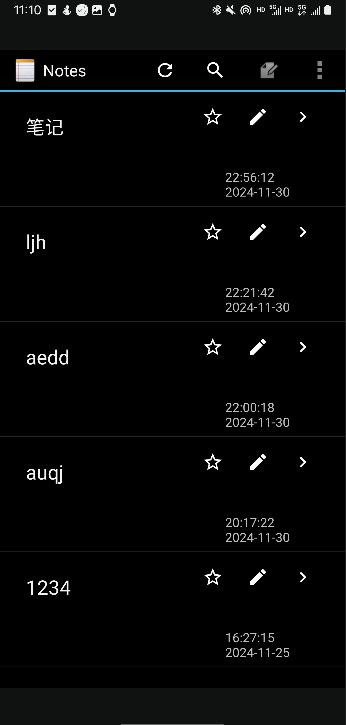
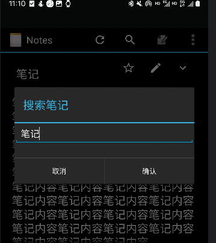
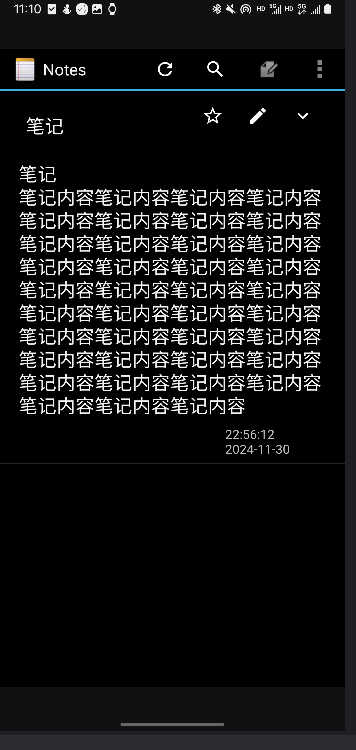
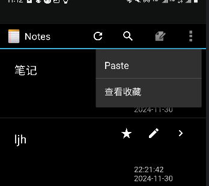
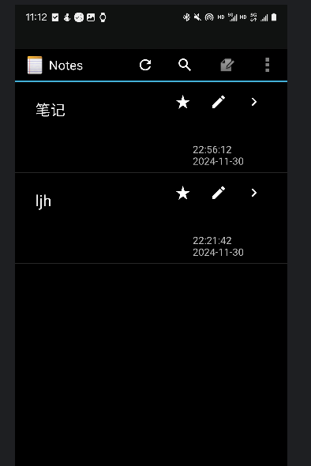
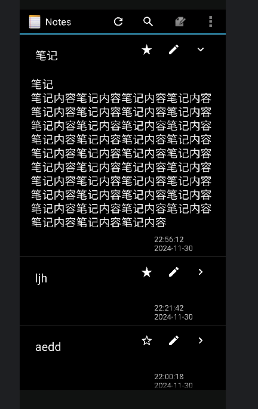

## 移动软件开发期中实验

### 1. `软件基本功能`
#### 1.1 `显示时间戳功能`
#### 1.1.1 `功能展示`

#### 1.1.2 `功能实现`
在投影中添加用到的项,并对应好项与对应的组件（添加一个text3文本组件来显示时间戳）
```properties
    private static final String[] PROJECTION = new String[]{
            NotePad.Notes._ID, // 0
            NotePad.Notes.COLUMN_NAME_TITLE, // 1
            NotePad.Notes.COLUMN_NAME_CREATE_DATE,  //2
            NotePad.Notes.COLUMN_NAME_COLLACTION,   //3
            NotePad.Notes.COLUMN_NAME_NOTE,  //4
            NotePad.Notes.COLUMN_NAME_UNFOLD
    };
    String[] dataColumns = {NotePad.Notes.COLUMN_NAME_TITLE, NotePad.Notes.COLUMN_NAME_CREATE_DATE,NotePad.Notes.COLUMN_NAME_NOTE,NotePad.Notes.COLUMN_NAME_UNFOLD};
    int[] viewIDs = {android.R.id.text1, android.R.id.text2,R.id.text3};
```
由于得到的CREATE_DATE是一个整型，所以要转换成时间戳需要进一步操作
```properties        
adapter.setViewBinder(new SimpleCursorAdapter.ViewBinder() {
            @Override
            public boolean setViewValue(View view, Cursor cursor, int columnIndex) {
                if (view.getId() == android.R.id.text2 && columnIndex == cursor.getColumnIndexOrThrow(NotePad.Notes.COLUMN_NAME_CREATE_DATE)) {
                    long createtime = cursor.getLong(columnIndex);
                    SimpleDateFormat sdf = new SimpleDateFormat("HH:mm:ss  yyyy-MM-dd ", Locale.getDefault());
                    String formattedDate = sdf.format(new Date(createtime));
                    ((TextView) view).setText(formattedDate);
                    return true;
                }
                return false;
            }
        });
```

#### 1.2 `笔记内容搜索功能`
#### 1.2.1 `功能展示`
点击显示文本框输入要查询的内容，点击确定后查询


#### 1.2.2 `功能实现`
新建一个menu组件，点击触发文本框，点击确定后触发条件查询
```properties
{
case R.id.menu_select:
showSearchDialog();
return true;
}
```
```properties
String[] projection = {NotePad.Notes._ID, NotePad.Notes.COLUMN_NAME_TITLE, NotePad.Notes.COLUMN_NAME_NOTE, NotePad.Notes.COLUMN_NAME_CREATE_DATE};
String selection = NotePad.Notes.COLUMN_NAME_TITLE + " LIKE ? OR " + NotePad.Notes.COLUMN_NAME_NOTE + " LIKE ?";
String[] selectionArgs = {"%" + searchText + "%", "%" + searchText + "%"};
String sortOrder = NotePad.Notes.DEFAULT_SORT_ORDER;
Cursor cursor = managedQuery(
getIntent().getData(),
PROJECTION,
selection,
selectionArgs,
NotePad.Notes.DEFAULT_SORT_ORDER 
);
```


### 2. `软件拓展功能`

#### 2.1 `收藏笔记功能`
#### 2.1.1 `功能展示`


#### 2.1.2 `功能实现`
在NotePadProvider类中为NOTE新增一列NotePad.Notes.COLUMN_NAME_COLLACTION值为1收藏，0不收藏
```properties  
@Override
public void onCreate(SQLiteDatabase db) {
db.execSQL("CREATE TABLE " + NotePad.Notes.TABLE_NAME + " ("
+ NotePad.Notes._ID + " INTEGER PRIMARY KEY,"
+ NotePad.Notes.COLUMN_NAME_TITLE + " TEXT,"
+ NotePad.Notes.COLUMN_NAME_NOTE + " TEXT,"
+ NotePad.Notes.COLUMN_NAME_CREATE_DATE + " INTEGER,"
+ NotePad.Notes.COLUMN_NAME_MODIFICATION_DATE + " INTEGER,"
+ NotePad.Notes.COLUMN_NAME_COLLACTION + " INTEGER,"
+ NotePad.Notes.COLUMN_NAME_UNFOLD + " INTEGER"
+ ");");
}
);
```
添加一个按钮，点击时NotePad.Notes.COLUMN_NAME_COLLACTION为1则设为0，为0设为1
```properties  
    public void onClickCollaction(View view) {
...
// 切换 COLLACTION 值
ContentValues values = new ContentValues();
int currentCollaction = cursor.getInt(cursor.getColumnIndexOrThrow(NotePad.Notes.COLUMN_NAME_COLLACTION));
values.put(NotePad.Notes.COLUMN_NAME_COLLACTION, currentCollaction == 1 ? 0 : 1);

// 更新数据库
getContentResolver().update(
NotePad.Notes.CONTENT_URI,
values,
NotePad.Notes._ID + "=?",
new String[]{String.valueOf(id)}
);
...
}
```
设计一个NotesCursorAdapter类来根据NotePad.Notes.COLUMN_NAME_COLLACTION的值显示相应的图标
```properties  
if (collaction == 1) {
imageButton.setImageResource(R.drawable.baseline_star_rate_white_24dp);
} else {
imageButton.setImageResource(R.drawable.baseline_star_border_white_24dp);
}
```
最后设计一个menu组件，点击后只显示收藏的笔记，点击后触发条件查询NotePad.Notes.COLUMN_NAME_COLLACTION的值为1的笔记
```properties  
String selection = NotePad.Notes.COLUMN_NAME_COLLACTION + " = 1 ";
Cursor cursor = managedQuery(
getIntent().getData(),            // Use the default content URI for the provider.
PROJECTION,                       // Return the note ID and title for each note.
selection,                             // No where clause, return all records.
null,                             // No where clause, therefore no where column values.
NotePad.Notes.DEFAULT_SORT_ORDER  // Use the default sort order.
);
```

#### 2.2 `笔记展开收起功能`
#### 2.2.1 `功能展示`

#### 2.2.2 `功能实现`
在NotePadProvider类中为NOTE新增一列NotePad.Notes.COLUMN_NAME_UNFOLD值为1展开，0收起
代码如2.1.2所示

点击按钮后显示笔记内容，设计一个新的text组件来展示笔记内容，NotePad.Notes.COLUMN_NAME_UNFOLD为1时设组件的visible为View.VISIBLE，为0时则为View.GONE

```properties  
public void onClickOpenOrNarrow(View view) {
View parentView = (View) view.getParent();
ListView listView = getListView();
int position = listView.getPositionForView(parentView);
long id =-1;
// 获取当前项的 cursor
Cursor cursor = (Cursor) getListAdapter().getItem(position);
if (cursor != null && !cursor.isClosed()) {
id = cursor.getLong(cursor.getColumnIndexOrThrow(NotePad.Notes._ID));
}
ContentValues values = new ContentValues();
int currentUNFOLD = cursor.getInt(cursor.getColumnIndexOrThrow(NotePad.Notes.COLUMN_NAME_UNFOLD));
values.put(NotePad.Notes.COLUMN_NAME_UNFOLD, currentUNFOLD == 1 ? 0 : 1);
getContentResolver().update(
NotePad.Notes.CONTENT_URI,
values,
NotePad.Notes._ID + "=?",
new String[]{String.valueOf(id)}
);
refresh_list();
}

TextView textView = (TextView) view.findViewById(R.id.text3);
if (unfold == 1) {
button1.setImageResource(R.drawable.baseline_keyboard_arrow_right_white_24dp);
textView.setVisibility(View.GONE);
} else {
button1.setImageResource(R.drawable.baseline_keyboard_arrow_down_white_24dp);
textView.setVisibility(View.VISIBLE);
}
```


#### 2.3 `其他小功能`
#### 2.3.1 `按钮使用ImageButton，并且会随收藏与展开与否变化`
#### 2.3.2 `刷新笔记列表功能`
