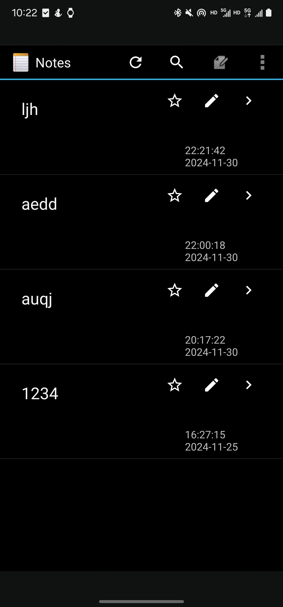

## 移动软件开发期中实验

### 1. `软件展示`
#### 1.1 '显示时间戳功能'
#### 1.1.1 '功能展示'

#### 1.1.2 '功能实现'

#### 1.2 '笔记内容搜索功能'
#### 1.2.1 '功能展示'


### 2. `gradle-wrapper.properties`

### 3.  `build.gradle(notepad)`
### 4. `build成功之后`
#### 4.1 `Error:Execution failed for task ':app:packageDebug'... 出现这个报错`
build.gradle（:app）中的 android{ ... } 中 添加：


```properties
packagingOptions {
    exclude 'META-INF/DEPENDENCIES.txt'
    exclude 'META-INF/LICENSE.txt'
    exclude 'META-INF/NOTICE.txt'
    exclude 'META-INF/NOTICE'
    exclude 'META-INF/LICENSE'
    exclude 'META-INF/DEPENDENCIES'
    exclude 'META-INF/notice.txt'
    exclude 'META-INF/license.txt'
    exclude 'META-INF/dependencies.txt'
    exclude 'META-INF/LGPL2.1'
}
```
#### 4.2 `com.android.ide.common.signing.KeytoolException: Failed to read key AndroidDebugKey from store出现这个问题`
请删除以下两个文件并clean build之后rebuild（此文件的地址请看报错信息）:

